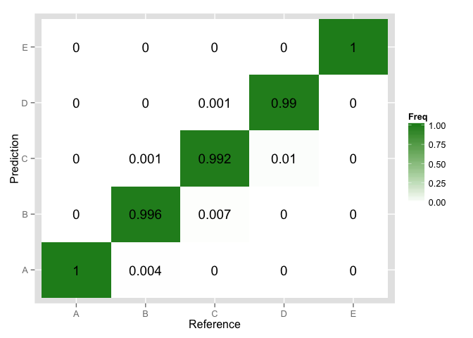

# Practical ML Project

--- Background

In this project, we are going to use activity data collected from accelerometers, magnetometers and gyrometers on on the belt, forearm, arm, and dumbell of 6 participants to build a machine learnning model to access the activity patterns. The paticipants were asked to perform barbell lifts correctly and incorrectly in 5 different ways. More information is available from the original research group's website here: http://groupware.les.inf.puc-rio.br/har.

The goal of the machine learning model is to predict the manner in which the participants did the exercise, which was labeled "classe" variable in the training set. This project can be divided into the following sections: 1) getting and cleaning data; 2) splitting data for cross-validation; 3) training the model by random forest; 4) cross-validating model and 5) predicting the manner from the testing data set. 

--- Getting & Cleaning Data


```r
if (!file.exists("pml-training.csv"))
download.file(destfile = pml-training,csv, url = "https://d396qusza40orc.cloudfront.net/predmachlearn/pml-training.csv")
if (!file.exists("pml-testing.csv"))
download.file(destfile = pml-testing,csv, url = "https://d396qusza40orc.cloudfront.net/predmachlearn/pml-testing.csv")
rawData <- read.csv("pml-training.csv", na.string = c("", "NA", "NULL"))
testData <- read.csv("pml-testing.csv", na.string = c("", "NA", "NULL"))
```

Because there are a lot of missing values in the data set, which are not useful for model building but only will increase the training time, those columns with missing values are truncated from the training set. Since the first 7 columns are information about participants' ID, time stamps and window selection information, they are not useful to the training either. They will be also dropped from the training set.


```r
# dropping columns with NA
data <- rawData[, colSums(is.na(rawData)) == 0]
# droping the first 7 columns
data <- data[, -c(1:7)]
```

--- Splitting Data for Cross-validation

The training data set is splitted into a training set (70%) and a test set (30%).


--- Training the Model by Random Forest

The `train` function with `method = "rf"` performs bootstrapping (x25 times) and parameter optimization techniques (x number of combinations) which takes a lot of computing time. To speed up the training process, these default settings are turned off and the parrallel computing with multi-cores are turned on.


```r
fitControl <- trainControl(method = "none", allowParallel=TRUE)
tgrid <- expand.grid(mtry=c(6))
modFit <- train(classe ~ ., method = "rf", data = training, trControl = fitControl, tuneGrid = tgrid)
```

--- Cross-validating Model 

Now that we have the random forest model trained based on our training data set, it's time to take a look at the model's performance on the test set.


```r
pred <- predict(modFit, newdata = testing)
confM <- confusionMatrix(pred, testing$classe)
confM$overall
```

```
##       Accuracy          Kappa  AccuracyLower  AccuracyUpper   AccuracyNull 
##      0.9960918      0.9950560      0.9941415      0.9975209      0.2844520 
## AccuracyPValue  McnemarPValue 
##      0.0000000            NaN
```

It would be more intuitive to take a look at the visualization of the confusion matrix.


```r
# extract the comparison table and calculate the accuracy percentage for each class
tmp <- confM$table
c <- t(t(tmp)/colSums(tmp))
library(ggplot2)
ggplot(as.data.frame(c)) + geom_tile(aes(x= Reference, y = Prediction, fill = Freq)) +  geom_text(aes(x= Reference, y = Prediction, fill = Freq, label = round(Freq, 3))) + scale_fill_gradient(high = "forestgreen", low = "white") 
```

 

It's good to see the prediction accuracy is around 99% for all classes. We're confident to use this model to predict the real testing data set now.

--- Predicting the Manner from the Testing Data Set

```r
predict(modFit, newdata = testData)
```

```
##  [1] B A B A A E D B A A B C B A E E A B B B
## Levels: A B C D E
```

--- Summary

This project has used the random forest algorithm from the Caret package to train the activity data set and has successfully obtained an overal accuracy over 99% upon cross-validation.
